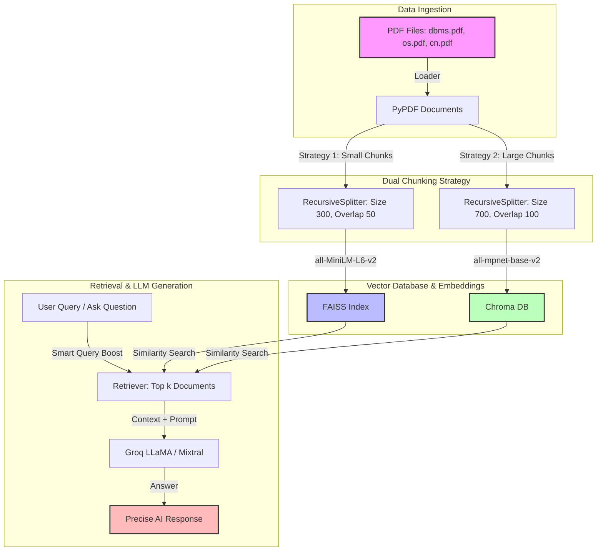

# ⚡ Smart AI RAG Chatbot

An advanced, high-performance **Retrieval-Augmented Generation (RAG)** chatbot built to compare different ingestion strategies, embedding models, and vector databases. This project enables you to query academic/technical PDF documents (like DBMS, Operating Systems, and Computer Networks) and get precise, context-aware answers in real-time.

---

## 🏗️ Architecture & Data Flow

Below is the visual flow of how documents are loaded, processed, indexed, and retrieved inside this system:



---

## 📊 Strategy Comparison

This codebase is specifically engineered to test and compare two different RAG pipelines:

| Feature | Pipeline A 🚀 (Fast & Lightweight) | Pipeline B 🎯 (Rich & Highly Accurate) |
| :--- | :--- | :--- |
| **Vector Database** | **FAISS** (Facebook AI Similarity Search) | **Chroma DB** (Persistent Store) |
| **Embedding Model** | `sentence-transformers/all-MiniLM-L6-v2` | `sentence-transformers/all-mpnet-base-v2` |
| **Chunk Size** | 300 characters | 700 characters |
| **Chunk Overlap** | 50 characters | 100 characters |
| **LLM Model** | LLaMA 3.1 8B (`llama-3.1-8b-instant`) | LLaMA 3.1 70B (`llama-3.1-70b-versatile`) |
| **Use Case** | Fast queries, low memory footprint | Deep explanations, complex reasoning |

---

## 📂 Project Structure

```directory
rag-project/
├── data/                    # Put your PDF documents here (e.g., dbms.pdf, os.pdf, cn.pdf)
├── faiss_index/             # Saved local FAISS vector index files
├── chroma_db/               # Saved persistent Chroma DB vector database files
├── src/                     # Core application source code
│   ├── app.py               # Streamlit interactive UI application
│   ├── main.py              # CLI interactive RAG application with smart query boost
│   ├── loader.py            # PDF document loader utilizing PyPDFLoader
│   ├── chunking.py          # Implements dual-strategy document chunking
│   ├── embedding.py         # Configures MiniLM and MPNet HuggingFace embeddings
│   ├── vector_db.py         # Handles creating and loading FAISS/Chroma DBs
│   ├── llm.py               # Connects to Groq API (LLaMA 3.1 8B / 70B models)
│   ├── retriever.py         # Retrieval helper testing both databases
│   ├── rag_llm.py           # Command-line testing harness for RAG QA
│   └── qa_system.py         # CLI testing harness with fallback options
└── README.md                # Project documentation (You are here!)
```

---

## 🛠️ Setup & Installation

### 1. Clone & Navigate to Project
Open your terminal and navigate to the project directory:
```bash
cd rag-project
```

### 2. Setup Virtual Environment (Recommended)
Create and activate a Python virtual environment:
```bash
# On Windows
python -m venv venv
venv\Scripts\activate

# On macOS/Linux
python3 -m venv venv
source venv/bin/activate
```

### 3. Install Dependencies
Install all required libraries using `pip`:
```bash
pip install streamlit langchain langchain-community langchain-text-splitters sentence-transformers faiss-cpu chromadb groq pypdf
```

### 4. API Key Configuration
This application uses the Groq API for rapid LLM inference.
- Open `src/app.py`, `src/llm.py`, `src/rag_llm.py`, and `src/retriever.py`.
- Replace the placeholder API key with your own **Groq API Key**:
  ```python
  client = Groq(api_key="YOUR_GROQ_API_KEY")
  ```

### 5. Add PDF Data
Place your PDF textbook or lecture slides (e.g., `dbms.pdf`, `os.pdf`, `cn.pdf`) inside the `data/` folder. The loader will automatically read all `.pdf` files present in this folder.

---

## 🚀 How to Run

### Step 1: Initialize the Vector Databases
First, parse the PDFs, split them into chunks, compute embeddings, and build the FAISS & Chroma databases:
```bash
python src/vector_db.py
```
*You will see the message:* `✅ FAISS + CHROMA created successfully`

---

### Step 2: Launch the Applications

You can interact with the chatbot in two ways:

#### Option A: Interactive Streamlit UI (Recommended)
Launch the beautiful browser-based UI to compare FAISS and Chroma side-by-side:
```bash
streamlit run src/app.py
```
This opens a local server (usually at `http://localhost:8501`) where you can chat and view responses from both RAG pipelines simultaneously!

#### Option B: Fast CLI Terminal Mode
Run the CLI loop directly in your command line:
```bash
python src/main.py
```
Ask questions directly in the terminal. The CLI uses **Smart Query Boosting** (adding domain context tags automatically) to maximize retrieval relevance.

---

## 💡 Key Code Highlights

### Smart Query Boosting (`src/main.py`)
To improve context retrieval from general academic questions, the CLI automatically expands the user's search query with domain context:
```python
better_query = query + " definition explanation in DBMS database computer networks operating system"
retrieved_docs = retriever.invoke(better_query)
```

### Side-by-Side Comparison UI (`src/app.py`)
Streamlit allows comparing both Vector DBs and Embedding Models in a single prompt:
```python
ans1 = get_answer(faiss_db, "llama-3.1-8b-instant", query)    # FAISS + MiniLM
ans2 = get_answer(chroma_db, "llama-3.1-8b-instant", query)   # Chroma + MPNet
```

---

## 🌟 Future Improvements
- **Hybrid Search**: Integrate Keyword Search (BM25) with Vector Search (FAISS/Chroma).
- **Reranking**: Add a Cohere or Cross-Encoder Reranker to prioritize the best context chunks.
- **Dynamic PDF Upload**: Allow users to drag-and-drop PDFs directly through the Streamlit interface.
- **Conversation Memory**: Track previous prompts and answers to allow multi-turn context-aware chat.

---
*Developed with ❤️ to compare and optimize RAG performance.*
